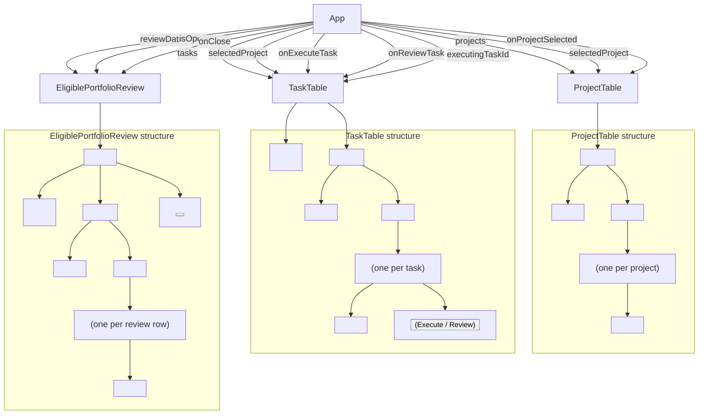

```mermaid
flowchart TD
    App["App"]

    PT["ProjectTable"]
    TT["TaskTable"]
    EPR["EligiblePortfolioReview"]

    App -->|projects| PT
    App -->|selectedProject| PT
    App -->|onProjectSelected| PT

    App -->|tasks| TT
    App -->|selectedProject| TT
    App -->|onExecuteTask| TT
    App -->|onReviewTask| TT
    App -->|executingTaskId| TT

    App -->|reviewData| EPR
    App -->|isOpen| EPR
    App -->|onClose| EPR

    subgraph PTTree["ProjectTable structure"]
        PTTable["<table>"]
        PTThead["<thead>"]
        PTBody["<tbody>"]
        PTRow["<tr> (one per project)"]
        PTCells["<td>"]
    end

    PT --> PTTable
    PTTable --> PTThead
    PTTable --> PTBody
    PTBody --> PTRow
    PTRow --> PTCells

    subgraph TTTree["TaskTable structure"]
        TTH2["<h2>"]
        TTTable["<table>"]
        TTThead["<thead>"]
        TTBody["<tbody>"]
        TTRow["<tr> (one per task)"]
        TTCell["<td>"]
        TTButton["<button> (Execute / Review)"]
    end

    TT --> TTH2
    TT --> TTTable
    TTTable --> TTThead
    TTTable --> TTBody
    TTBody --> TTRow
    TTRow --> TTCell
    TTRow --> TTButton

    subgraph EPRTree["EligiblePortfolioReview structure"]
        Dialog["<dialog>"]
        Heading["<h2>"]
        EPRTable["<table>"]
        EPRThead["<thead>"]
        EPRBody["<tbody>"]
        EPRRow["<tr> (one per review row)"]
        EPRCell["<td>"]
        CloseBtn["<button>"]
    end

    EPR --> Dialog
    Dialog --> Heading
    Dialog --> EPRTable
    EPRTable --> EPRThead
    EPRTable --> EPRBody
    EPRBody --> EPRRow
    EPRRow --> EPRCell
    Dialog --> CloseBtn
```